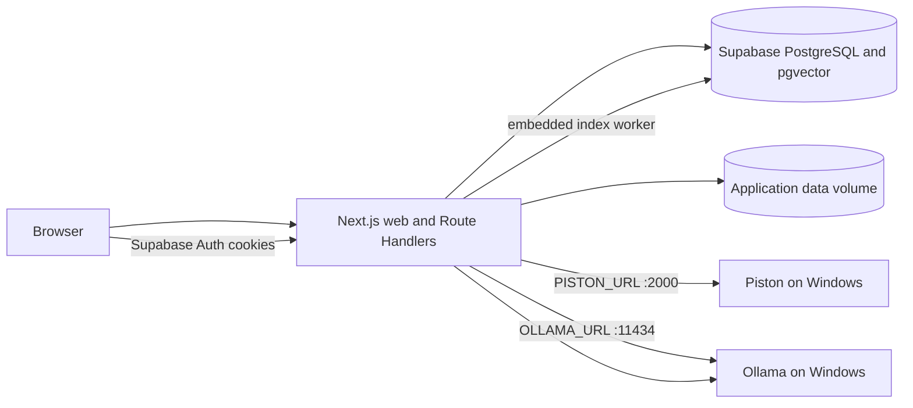

# CodeArea

CodeArea is a Next.js full-stack coding-learning platform. Supabase provides hosted PostgreSQL, pgvector, and Auth; Piston and Ollama run externally on the Windows desktop.

## Architecture



The root application runs as one Next.js process. It contains the UI, Route Handlers, domain modules, and the background AI index loop. There is no separate root database or worker service.

Resource-heavy services run independently on the Windows host:

- [`utils/executor`](utils/executor/README.md) is the minimal vendored Piston runtime configured by `PISTON_URL`.
- [`utils/chatbot`](utils/chatbot/README.md) is the independently versioned `raksitbell/codearea_chatbot` repository, reduced to the native Ollama service used by this application.
- The consolidated application talks directly to the Windows Ollama instance configured by `OLLAMA_URL`; it does not route inference through a combined compute gateway.

There is no Express gateway, local PostgreSQL service, Redis, FastAPI, ChromaDB, Judge0, PDF ingestion, standalone AI Tutor UI, or browser-configurable service URL.

## Setup

Requirements: Node.js 22+, npm, the hosted Supabase `codearea` project, and reachable Piston and Ollama APIs.

Initialize the chatbot submodule when cloning the repository:

```bash
git submodule update --init --recursive
```

```text
utils/executor/   vendored Piston runtime
utils/chatbot/    Ollama-only Git submodule
```

### One-time Supabase setup

In the Supabase dashboard:

1. Open **Authentication → Providers → Email** and disable **Confirm email** so signup returns a session immediately.
2. Open **Authentication → URL Configuration** and set the site URL to `http://localhost:3000` for development.
3. Add `http://localhost:3000/api/auth/callback` to the allowed redirect URLs.
4. Open **Connect**, select the session pooler on port `5432`, and copy its PostgreSQL URI.

Create `.env`, then replace the database password, pooler host, publishable key, and Windows utility host:

```bash
cp .env.example .env
npm ci
npm run dev
```

`npm run dev` applies migrations, seeds fixed data, starts Next.js with hot reload, and starts the AI indexing loop in the same process. Open <http://localhost:3000>.

To create the first administrator, register with the `ADMIN_EMAIL` address and rerun `npm run db:seed` once. New registrations use Supabase Auth and enter immediately without an email verification message.

### Production-style Compose

The optional Compose workflow still runs only one CodeArea service:

```bash
cp .env.example .env
docker compose up -d --build
docker compose ps
```

Open <http://localhost:3000>. The web container applies migrations and seeds before starting. Markdown Problems and profile images are stored in the `app-data` volume; relational and vector data remain in Supabase.

Set `PISTON_URL=http://<windows-host-or-domain>:2000` and `OLLAMA_URL=http://<windows-host-or-domain>:11434` in `.env`. Only the Next.js web port is published by Compose.

### Database access

Use Supabase **Table Editor** or **SQL Editor** for browser-based access. For `psql`, use the session-pooler URI copied from the Supabase **Connect** panel:

```bash
psql "$DATABASE_URL"
```

Useful `psql` commands are `\dt` to list tables, `\d users` to inspect the users table, and `\q` to quit. Run a single read-only query without opening the shell with:

```bash
psql "$DATABASE_URL" -c "select id, auth_user_id, email, created_at from users order by id;"
```

The database password is required by Drizzle and must stay server-only. The Supabase publishable key is used for Auth SSR cookies; no service-role or secret key is exposed to the browser.

## Development commands

| Command | Purpose |
| --- | --- |
| `npm run dev` | Migrate, seed, and start the single Next.js development process |
| `npm run lint` | Run ESLint |
| `npm run typecheck` | Check TypeScript without emitting files |
| `npm test` | Run Vitest tests |
| `npm run build` | Create a production build |
| `npm run db:generate` | Generate Drizzle migrations from the schema |
| `npm run db:migrate` | Apply pending migrations |
| `npm run db:seed` | Idempotently seed system data and optional admin |

## Domain structure

```text
app/api/                 Thin HTTP and SSE Route Handlers
server/auth/             Supabase Auth SSR and application profiles
server/problems/         Markdown drafts, immutable revisions, publish lifecycle
server/executor/         Piston adapter and execution allowlist
server/submissions/      Grading and test results
server/progress/         Points, Achievements, and Bangkok-day streaks
server/chatbot/          Ollama adapter, retrieval, indexing, and typed Tutor events
server/db/               Drizzle schema and lazy database client
drizzle/                 Versioned PostgreSQL migrations
scripts/                 Migration and seed entrypoints
```

Route Handlers translate HTTP only. Domain behavior and typed errors stay inside the server modules.

## Problem lifecycle

1. An administrator creates or updates a mutable Markdown draft.
2. The file store writes through a temporary file and atomic rename on `app-data`.
3. Publish verifies the SHA-256 checksum and locks the Problem row.
4. A new immutable `problems/<id>/revisions/<revision>-<unique-id>.md` file is created while the Problem row is locked.
5. The revision, published pointer, revision-bound tests/tags, and idempotent AI index job are recorded in one database transaction.
6. A failed transaction removes the new revision file; a failed draft update restores the previous file.
7. The worker indexes only learner-safe Markdown. Solutions, staff notes, and hidden tests remain relational.

## Main interfaces

- Auth: `/api/auth/register`, `/login`, `/logout`, `/me`, `/forgot-password`, `/reset-password`
- Problems: `/api/problems`, `/api/problems/:slug`, draft update, publish, revisions, and index status
- Learning: `/api/executor/run`, `/api/submissions`, `/api/categories`, `/api/tags`, `/api/leaderboard`
- Progress: `/api/achievements`, `/api/profile-progress`, `/api/streak`
- AI Tutor: authenticated `POST /api/chatbot/chat` with `hint`, `compare`, or `analyze`

Tutor responses use typed SSE events in this order: `meta`, zero or more `citation`, `token`, then `done`; failures use `error`.

## Security notes

- Supabase Auth manages passwords, recovery, refresh tokens, and SSR cookies; CodeArea never stores password hashes.
- Confirm-email is disabled, so registration signs the new user in immediately without challenging email ownership.
- Public application tables have RLS enabled and Data API roles have no grants; trusted Next.js code uses the server-only PostgreSQL connection.
- Route Handlers re-check authentication and authorization; client navigation guards are presentation only.
- Hidden tests and canonical solutions are never included in learner Problem responses or pgvector chunks.
- Piston language/version pairs and limits come from environment variables, never request-supplied URLs.
- Native Piston and Ollama APIs do not provide CodeArea authentication. Restrict Windows Firewall rules for ports `2000` and `11434` to the application host's IP and trusted private network only.
- Profile images are validated, size-limited, and stored on the private application-data volume.
