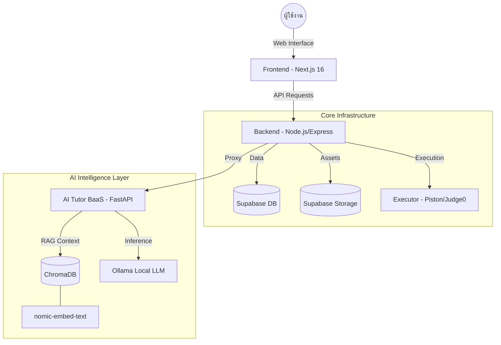
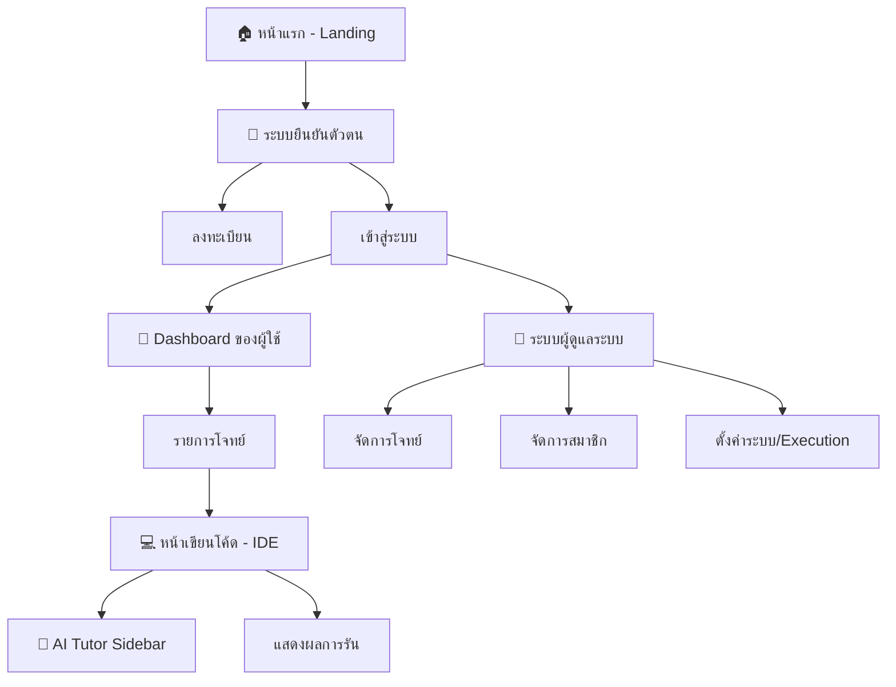
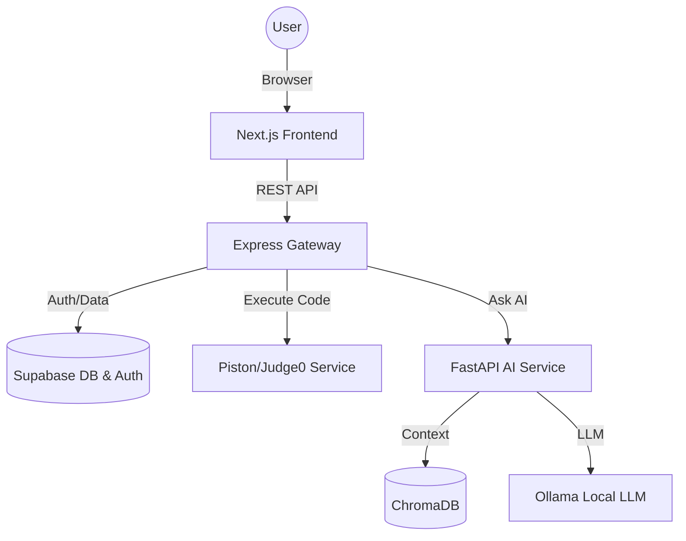

# 🚀 CodeArea — Full-Stack Coding Platform

**CodeArea** คือแพลตฟอร์มการเรียนรู้แบบรวมศูนย์ (Unified Platform) ที่ช่วยให้ผู้ใช้งานสามารถฝึกฝนการเขียนโค้ดได้ทันทีผ่านเว็บเบราว์เซอร์ โดยบูรณาการเทคโนโลยี AI Tutor เพื่อยกระดับประสบการณ์การเรียนรู้และลดกำแพงในการเข้าถึงความรู้ทางเทคนิค

---

## 📖 1. บทนำและวัตถุประสงค์ (Introduction)

### ภูมิหลังความเป็นมา
ในปัจจุบัน ผู้เริ่มต้นมักประสบปัญหาในช่วงเริ่มต้น เช่น ความยุ่งยากในการติดตั้งสภาพแวดล้อม (Environment) และการขาดที่ปรึกษาเมื่อติดปัญหา โครงงานนี้จึงถูกพัฒนาขึ้นเพื่อให้ผู้ใช้ฝึกเขียนโค้ดได้ทันทีและมี AI ช่วยให้คำแนะนำแบบเรียลไทม์

### วัตถุประสงค์หลัก
1. พัฒนาแพลตฟอร์มฝึกเขียนโค้ดที่ทันสมัยและใช้งานง่าย
2. สร้างระบบประมวลผลโค้ด (Execution Engine) ในพื้นที่ปลอดภัย (Sandbox)
3. บูรณาการ AI Tutor (RAG) เพื่อวิเคราะห์และให้คำปรึกษา
4. สร้าง Admin Dashboard สำหรับจัดการโจทย์และสมาชิกอย่างมีประสิทธิภาพ

---

## ✨ 2. คุณสมบัติเด่น (Key Features)

- 📝 **Monaco Editor Integration**: ใช้งาน Engine เดียวกับ VS Code
- 🚀 **Universal Code Execution**: รันโค้ดได้หลายภาษาผ่าน Piston/Judge0
- 🤖 **AI Tutor BaaS**: ใช้เทคนิค RAG ให้คำแนะนำที่แม่นยำตามบทเรียน
- 📊 **Real-time Leaderboard**: ระบบจัดอันดับผู้ใช้งานตามคะแนน
- 🛡️ **System-wide Audit Logs**: บันทึกกิจกรรมสำคัญเพื่อความโปร่งใส

---

## 🏗️ 3. สถาปัตยกรรมระบบ (Project Architecture)



### รายละเอียดระบบ AI Tutor
- **FastAPI Engine**: ใช้ Python จัดการ Logic และ Streaming Response
- **RAG Pipeline**: ดึงบริบทจากไฟล์ PDF ใน ChromaDB เพื่อลดการบิดเบือนข้อมูล
- **Local LLM**: ประมวลผลผ่าน Ollama (Qwen/Gemma) ในเครื่อง Local

---

## 🗺️ 4. แผนผังโครงสร้างและลำดับการใช้งาน

### Site Map


### Storyboard (User Journey)
1. **Landing & Auth**: ผู้ใช้สมัครสมาชิกและเข้าสู่ระบบ
2. **Question Browsing**: เลือกโจทย์ตามหมวดหมู่และระดับความยาก
3. **Coding & AI Helping**: เขียนโค้ดใน IDE หากสงสัยสามารถถาม AI Tutor ได้ทันที
4. **Run & Submit**: ทดสอบโค้ดและส่งผลเพื่อบันทึกสถิติและคะแนน

---

## 🛠️ 5. เทคโนโลยีที่ใช้ (Technical Stack)

### 🌐 Frontend
| เทคโนโลยี | Badge | คำอธิบาย |
| :--- | :--- | :--- |
| **Next.js 16** |  | Framework หลัก (App Router) |
| **React 19** |  | UI Library |
| **Tailwind v4** |  | Utility-first CSS Framework |
| **Monaco Editor** |  | ตัวแก้ไขโค้ดระดับแนวหน้า (VS Code Engine) |
| **DaisyUI** |  | Library สำหรับ UI Components |

### ⚙️ Backend & Database
| เทคโนโลยี | Badge | คำอธิบาย |
| :--- | :--- | :--- |
| **Node.js** |  | Runtime v18+ |
| **Express.js** |  | REST API Framework |
| **Supabase** |  | ฐานข้อมูล PostgreSQL |
| **Redis** |  | Session / Token Store |
| **Docker** |  | รัน Code Executor (Piston/Judge0) |
| **JWT** |  | ระบบ Authentication |
| **FastAPI** |  | AI Tutor Backend-as-a-Service |

---

## 🔍 6. อัลกอริทึมที่สำคัญ (System Algorithms)

- ⏳ **Deferred Search**: ใช้ `useDeferredValue` เพื่อ UI ที่ตอบสนองได้ทันใจขณะค้นหา
- 🎯 **Vector Similarity Search**: ค้นหาเนื้อหาที่เกี่ยวข้องใน ChromaDB สำหรับ AI Tutor
- 📊 **Statistics Aggregation**: ใช้ `Map` ในการรวมผลข้อมูลการส่งโจทย์แยกตามหมวดหมู่
- 🛡️ **Audit Logging**: ระบบบันทึกประวัติกิจกรรมแบบ System-Wide

---

## 💻 7. รายละเอียดการพัฒนา (Technical Deep Dive)

### 🖥️ การจัดการ UI Layout
- **Dashboard**: ระบบ RBAC ตรวจสอบสิทธิ์ผ่าน JWT (role_id 1 คือผู้ใช้ทั่วไป)
- **Code Editor**: บูรณาการ Monaco Editor พร้อมระบบรันโค้ดแบบ Sandbox

### ⚙️ Backend Logic
- **Soft Deletion**: เปลี่ยนสถานะ `status` แทนการลบจริง
- **Streaming Response**: AI ส่งข้อมูลแบบ Token-by-token ผ่าน FastAPI

### 🧠 React Hooks ที่ใช้งาน
- `useState`, `useEffect`, `useMemo`, `useCallback`, `useDeferredValue`, `useRef`

---

## 🚀 8. การ Deployment และ Infrastructure

- **Railway CI/CD**: Auto-Deploy เมื่อมีการ Push ไปยัง GitHub
- **Git Submodules**: จัดการ Piston/Judge0 ผ่าน `npm run submodule:update`
- **Cloud Services**: Supabase (Database/Storage) และ Ollama Cloud (LLM)

---

## 📊 9. แผนผังการไหลของข้อมูล (System Flow)



---

## ตัวอย่างโจทย์

> [!IMPORTANT]
> **Developer Note for Integration (@frontend/app/dashboard/problems/new/page.tsx)**
> ข้อมูลในไฟล์นี้ถูกออกแบบมาให้สอดคล้องกับฟอร์มใน `ProblemUpsertForm`:
> - **TITLE**: ชื่อโจทย์
> - **CATEGORY**: หมวดหมู่ใหญ่
> - **DIFFICULTY**: 1 (ง่าย), 2 (ปานกลาง), 3 (ยาก)
> - **TAGS**: ป้ายกำกับโจทย์ (คั่นด้วย comma)
> - **CONSTRAINTS**: ข้อจำกัดของข้อมูล
> - **TIME LIMIT**: มิลลิวินาที (MS)
> - **MEMORY LIMIT**: กิโลไบต์ (KB)
> - **EXPECTED COMPLEXITY**: Time/Space
> - **DESCRIPTION**: เนื้อเรื่องโจทย์
> - **SOLUTION**: โค้ดตัวอย่าง
> - **TEST CASES**: (Input, Output, Order, Is Simple, Status)

---

### 1. ศิลาจารึกแห่งกระจกเงา (Palindrome Mirror)
- **เนื้อเรื่อง**: นักโบราณคดีได้ค้นพบ "วิหารแห่งกระจก" (The Mirror Temple) ซึ่งมีศิลาจารึกประหลาดวางอยู่หน้าทางเข้า เชื่อกันว่าเทพเจ้าแห่งมิติกระจกจะอนุญาตให้ผู้ที่ถือครอง "คำศักดิ์สิทธิ์" ผ่านเข้าไปได้เท่านั้น โดยคำศักดิ์สิทธิ์นี้มีความพิเศษคือ เมื่อมองผ่านกระจกสะท้อน (อ่านจากหลังมาหน้า) คำนั้นจะต้องยังคงเรียงตัวเหมือนเดิมทุกประการ
- **ความยาก**: ง่าย (1)
- **Tags**: String, Palindrome, Logic
- **Expected Complexity**: Time: O(N), Space: O(N)
- **ข้อจำกัด (Constraints)**: ความยาวของข้อความไม่เกิน 1,000 ตัวอักษร
- **Time Limit**: 1000 ms
- **Memory Limit**: 65536 KB
- **Test Cases**:

| Order | Input Data | Output Data | Is Simple | Status |
| :--- | :--- | :--- | :--- | :--- |
| 1 | level | Yes | True | Active |
| 2 | hello | No | True | Active |

- **โค้ดตัวอย่าง (C++)**:
```cpp
#include <iostream>
#include <string>
#include <algorithm>
using namespace std;
int main() {
    string s; cin >> s;
    string r = s;
    reverse(r.begin(), r.end());
    if (s == r) cout << "Yes";
    else cout << "No";
    return 0;
}
```

---

## 📚 บรรณานุกรม (Bibliography)
1.	เอกสารประกอบการพัฒนาเฟรมเวิร์ค Next.js (v16.2.4): https://nextjs.org/docs
2.	เอกสารประกอบการพัฒนาเฟรมเวิร์ค CSS Tailwind (v4): https://tailwindcss.com/docs/installation/framework-guides/nextjs
3.	เอกสารประกอบการพัฒนา Runtime Environment Node.js (18): https://nodejs.org/docs/latest-v18.x/api/index.html
4.	เอกสารประกอบการพัฒนาเว็บแอปพลิเคชันเฟรมเวิร์ค Express (v4): https://expressjs.com/en/4x/api.html
5.	เอกสารประกอบการพัฒนาไลบารี่ React (v19.2): https://react.dev/reference/react 
6.	เอกสารประกอบการพัฒนาฐานข้อมูล Supabase: https://supabase.com/docs
7.	เอกสารประกอบการพัฒนา API ของ Monaco Editor: https://microsoft.github.io/monaco-editor/
8.	เอกสารประกอบการพัฒนา Piston: https://github.com/engineer-man/piston
9.	เอกสารประกอบการพัฒนาโมเดลภาษาขนาดใหญ่ (LLM) Gemma 4 (Google): https://ai.google.dev/gemma/docs/integrations/ollama
10.	เอกสารประกอบการพัฒนาเฟรมเวิร์คสำหรับการจัดการโมเดลภาษาขนาดใหญ่ (LLMs on Local Machine) Ollama: https://docs.ollama.com