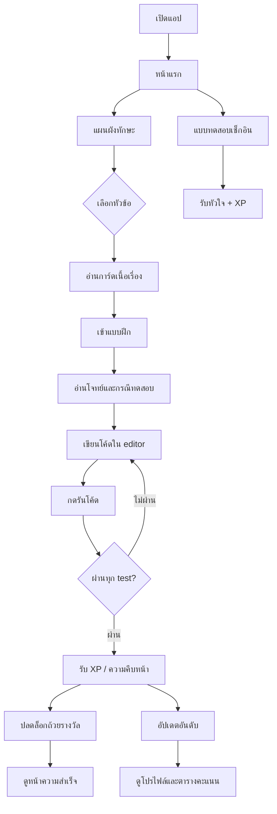

# CODEAREA

## Project Introduction

CODEAREA is a gamified programming-learning prototype built from the Codearea Stitch UI direction. It teaches computer-science fundamentals through Thai-first storytelling, playful progression, coding challenges, daily login quizzes, trophies, and leaderboard competition.

The app is designed as a Vite + React single-page experience. Navigation uses hash routes so the prototype works without a backend router.

## Concept Board

| Pillar | Direction |
| --- | --- |
| Theme | Technical mastery through play |
| Tone | Friendly, gummy, tactile, encouraging |
| Visual language | Rounded cards, physical button shadows, green success states, dark code editor |
| Core fantasy | Learner becomes a coding warrior progressing through story-based skill worlds |
| Audience | Beginner learners, students, hobbyists, and competitive coding learners |
| UI keywords | Skill tree, XP, hearts, streaks, trophies, daily reward, leaderboard |

## Game Mechanic Rule & Condition

- **XP:** Earned by completing lessons, passing challenge tests, and daily login quizzes.
- **Hearts:** Used for hints or retry support. Daily login quiz rewards +1 heart.
- **Daily Quiz:** Gives login reward when answered correctly: +1 heart and +50 XP.
- **Skill Progress:** Each subject tracks completion count and percentage.
- **Locked Skills:** Advanced topics stay locked until earlier modules are completed.
- **Challenge Run:** User writes code in the editor, presses run, then sees test-case output.
- **Achievements:** Trophy details show unlock rule, unlock date, current progress, and locked/unlocked state.
- **Leaderboard:** Users rank by XP. Top 3 are highlighted with medal podium cards.

## How to play

1. Open the app and start from the home page.
2. Go to **แผนผังทักษะ** to choose a learning path.
3. Pick a subject card and follow the story prompt.
4. Enter **แบบฝึก** to solve the coding challenge.
5. Press **รันโค้ด** to view test-case results.
6. Use daily login quiz to collect hearts and XP.
7. Track progress in profile, trophies, and leaderboard.

## Challenge Design

The current mock challenge is **ตรวจข้อความพาลินโดรม**.

- **Problem type:** String validation
- **Narrative frame:** A warrior decodes ancient text and checks whether it reads the same forward and backward.
- **Input:** `s`, a string containing letters, numbers, spaces, and symbols
- **Expected logic:** Normalize text, remove non-alphanumeric characters, compare left and right pointers
- **Feedback design:** Test cases are visible beside the problem. Output appears in a separate result panel after run.

## Progression

- **Beginner:** Syntax, variables, loops
- **Intermediate:** Arrays, strings, recursion
- **Advanced:** Dynamic programming, graphs, trees
- **Meta progression:** XP, streaks, hearts, trophies, leaderboard rank
- **Reward loop:** Learn → solve → pass tests → gain XP → unlock trophies → climb rank

## User Journey Flow



## Project Setup

```bash
npm install
npm run dev
```

Build production bundle:

```bash
npm run build
```

Preview production build:

```bash
npm run preview
```

## Tech stacks

- **Vite**: frontend build tool
- **React**: UI framework
- **CodeMirror**: real code editor for challenge page
- **Material Symbols**: icon system
- **shadcn-style local primitives**: Button, Card, Badge, Progress
- **CSS custom properties**: design tokens for colors, spacing, shadow, responsive layout
