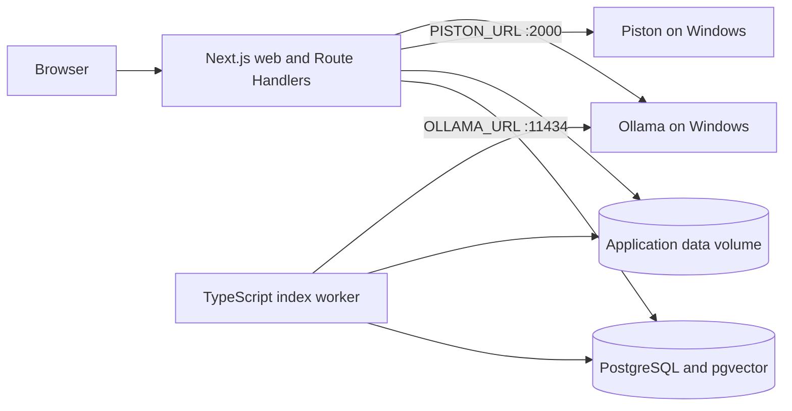

# CodeArea

CodeArea is a self-hosted coding-learning platform built as one Next.js full-stack application. Administrators author Problems in Markdown, learners run and submit code through Piston, and an Ollama-backed AI Tutor retrieves learner-safe content from PostgreSQL/pgvector.

## Architecture



The application Compose stack has three long-running processes:

- `web`: UI, authenticated Route Handlers, domain modules, migrations, and deterministic seeds
- `worker`: claims PostgreSQL index jobs and writes pgvector chunks
- `postgres`: PostgreSQL 17 with pgvector

Resource-heavy services run independently on the Windows host:

- [`utils/executor`](utils/executor/README.md) is the original `raksitbell/piston` repository and exposes the Piston API configured by `PISTON_URL`.
- [`utils/chatbot`](utils/chatbot/README.md) is the independently versioned `raksitbell/codearea_chatbot` repository, reduced to the native Ollama service used by this application.
- The consolidated application talks directly to the Windows Ollama instance configured by `OLLAMA_URL`; it does not route inference through a combined compute gateway.

There is no Express gateway, Supabase, Redis, FastAPI, ChromaDB, Judge0, PDF ingestion, standalone AI Tutor UI, or browser-configurable service URL in either the root runtime or chatbot utility.

## Local setup

Requirements: Node.js 22+, npm, Docker Compose, and reachable Windows utility hosts.

```bash
cp .env.example .env
npm ci
npm run typecheck
npm test
npm run build
docker compose up --build
```

Initialize Git submodules and configure the external repositories separately on the Windows host:

```bash
git submodule update --init --recursive
```

```text
utils/executor/   raksitbell/piston
utils/chatbot/    raksitbell/codearea_chatbot
```

The application is available at <http://localhost:3000>. Change `ADMIN_PASSWORD` in `.env`; `npm run db:seed` creates the bootstrap administrator only when both administrator variables are present.

Set `PISTON_URL=http://<windows-ip>:2000` and `OLLAMA_URL=http://<windows-ip>:11434` in the application `.env`. Persistent local volumes are `postgres-data` and `app-data`; only the Next.js web port is published by this stack.

## Development commands

| Command | Purpose |
| --- | --- |
| `npm run dev` | Start the Next.js development server |
| `npm run lint` | Run ESLint |
| `npm run typecheck` | Check TypeScript without emitting files |
| `npm test` | Run Vitest tests |
| `npm run build` | Create a production build |
| `npm run db:generate` | Generate Drizzle migrations from the schema |
| `npm run db:migrate` | Apply pending migrations |
| `npm run db:seed` | Idempotently seed system data and optional admin |
| `npm run worker` | Run the AI indexing worker |

## Domain structure

```text
app/api/                 Thin HTTP and SSE Route Handlers
server/auth/             PostgreSQL sessions and password reset
server/problems/         Markdown drafts, immutable revisions, publish lifecycle
server/executor/         Piston adapter and execution allowlist
server/submissions/      Grading and test results
server/progress/         Points, Achievements, and Bangkok-day streaks
server/chatbot/          Ollama adapter, retrieval, indexing, and typed Tutor events
server/db/               Drizzle schema and lazy database client
drizzle/                 Versioned PostgreSQL migrations
scripts/                 Migration, seed, and worker entrypoints
```

Route Handlers translate HTTP only. Domain behavior and typed errors stay inside the server modules.

## Problem lifecycle

1. An administrator creates or updates a mutable Markdown draft.
2. The file store writes through a temporary file and atomic rename on `app-data`.
3. Publish verifies the SHA-256 checksum and locks the Problem row.
4. A new immutable `problems/<id>/revisions/<revision>-<unique-id>.md` file is created while the Problem row is locked.
5. The revision, published pointer, revision-bound tests/tags, and idempotent AI index job are recorded in one database transaction.
6. A failed transaction removes the new revision file; a failed draft update restores the previous file.
7. The worker indexes only learner-safe Markdown. Solutions, staff notes, and hidden tests remain relational.

## Main interfaces

- Auth: `/api/auth/register`, `/login`, `/logout`, `/me`, `/forgot-password`, `/reset-password`
- Problems: `/api/problems`, `/api/problems/:slug`, draft update, publish, revisions, and index status
- Learning: `/api/executor/run`, `/api/submissions`, `/api/categories`, `/api/tags`, `/api/leaderboard`
- Progress: `/api/achievements`, `/api/profile-progress`, `/api/streak`
- AI Tutor: authenticated `POST /api/chatbot/chat` with `hint`, `compare`, or `analyze`

Tutor responses use typed SSE events in this order: `meta`, zero or more `citation`, `token`, then `done`; failures use `error`.

## Security notes

- Authentication uses an opaque HttpOnly, SameSite cookie backed by revocable PostgreSQL sessions.
- Route Handlers re-check authentication and authorization; client navigation guards are presentation only.
- Hidden tests and canonical solutions are never included in learner Problem responses or pgvector chunks.
- Piston language/version pairs and limits come from environment variables, never request-supplied URLs.
- Native Piston and Ollama APIs do not provide CodeArea authentication. Restrict Windows Firewall rules for ports `2000` and `11434` to the application host's IP and trusted private network only.
- Profile images are validated, size-limited, and stored on the private application-data volume.
