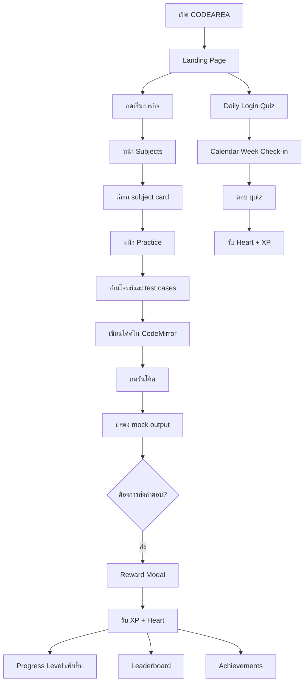

# CODEAREA

CODEAREA คือเว็บแอปต้นแบบสำหรับเรียนเขียนโปรแกรมแบบเกม ใช้แนวทาง UI จาก Stitch และปรับเป็นประสบการณ์ภาษาไทยเต็มรูปแบบ ผู้เล่นจะฝึกอัลกอริทึมผ่านภารกิจ, เรื่องเล่า, แบบฝึกเขียนโค้ด, แบบทดสอบเช็กอินรายวัน, XP, หัวใจ, ถ้วยรางวัล และตารางคะแนน

โปรเจกต์นี้เป็น Vite + React single-page app ใช้ hash route เพื่อให้เปิดใช้งานต้นแบบได้ง่ายโดยไม่ต้องมี backend router

## Project Introduction

เป้าหมายของ CODEAREA คือทำให้การฝึก algorithm รู้สึกเหมือนกำลังเล่นเกมฝึกฝีมือ ผู้เรียนเห็นความคืบหน้าตลอดเวลา ได้รับรางวัลทันทีหลังทำโจทย์ และมีแรงจูงใจกลับมาเรียนทุกวันผ่านสตรีกกับ daily login quiz

หน้าหลักถูกออกแบบใหม่ให้เป็น hero view แบบ immersive มีภาพพื้นหลัง, CTA ชัดเจน, summary metrics และ mock code output เพื่อสื่อสารทันทีว่าแอปนี้คือสนามฝึกเขียนโค้ด

## Concept Board

| หมวด | แนวทาง |
| --- | --- |
| Brand | CODEAREA |
| Theme | สนามฝึก algorithm ภาษาไทย |
| Tone | เป็นมิตร, gummy, modern, เล่นง่าย |
| Palette | darker pastel green เป็นสีหลัก พร้อม red/pink สำหรับหัวใจ, orange/red สำหรับสตรีก, yellow/gold สำหรับ XP |
| UI Style | Rounded panels, tactile button shadow, compact dashboard layout, dark code editor |
| Core Fantasy | ผู้เล่นเป็นนักรบโค้ดที่ฝึกทักษะเพื่อชนะสงครามของแต่ละหัวข้อ |
| Audience | ผู้เริ่มต้น, นักเรียน, นักศึกษา, คนฝึก coding interview |

## Game Mechanic Rule & Condition

- **XP:** ได้จากการทำแบบฝึก, ผ่าน test cases, ส่งคำตอบ และทำ daily login quiz
- **Heart:** ใช้กับปุ่ม hint และได้รับคืนจากรางวัล daily login หรือการส่งคำตอบ
- **Streak:** นับวันที่ผู้เล่นกลับมาใช้งานต่อเนื่อง
- **Daily Login Quiz:** แสดงเป็น calendar รายสัปดาห์ พร้อม quiz ด้านล่าง รางวัลคือหัวใจและ XP
- **Practice Run:** ผู้เล่นเขียนโค้ดใน CodeMirror แล้วกดรันเพื่อดู mock output
- **Submit Answer:** แสดงหลังรันโค้ดสำเร็จ และเปิด reward modal พร้อม progress bar การอัปเลเวล
- **Achievements:** แสดงเหมือน Steam achievement มีวิธีปลดล็อก, วันที่ปลดล็อก, สถานะ และ progress
- **Leaderboard:** ใช้ XP จัดอันดับ มี podium สำหรับ 3 อันดับแรกพร้อม medal icon และ avatar จาก DiceBear

## How To Play

1. เปิดหน้าแรกแล้วกด **เริ่มภารกิจ**
2. เลือกหัวข้อจากหน้า **หัวข้อ**
3. อ่านเรื่องเล่าของหัวข้อและเข้าสู่หน้า **แบบฝึก**
4. เขียนโค้ดใน editor จริง
5. กด **รันโค้ด** เพื่อดูผล test output
6. กด **ส่งคำตอบ** เพื่อรับ XP, หัวใจ และดู progress level
7. กลับมาเช็กอินรายวันที่หน้า quiz เพื่อสะสม streak
8. ตรวจอันดับที่ leaderboard และดูถ้วยรางวัลใน profile/achievements

## Challenge Design

โจทย์ mock ปัจจุบันคือ **ตรวจข้อความพาลินโดรม**

- **ประเภทโจทย์:** String validation
- **ภาษาโจทย์:** ไทย
- **เรื่องเล่า:** นักรบต้องอ่านข้อความโบราณให้ถูกต้องเพื่อผ่านประตูสนามรบ
- **Input:** ข้อความที่อาจมีตัวอักษร, ตัวเลข, ช่องว่าง และสัญลักษณ์
- **Expected Logic:** Normalize ข้อความ, ตัดอักขระที่ไม่ต้องใช้, เปรียบเทียบจากซ้ายและขวา
- **Test Cases:** อยู่ในส่วน subject/problem panel
- **Output:** แยกเป็น panel ของตัวเองหลังรันโค้ด

## Progression

- **Beginner:** Syntax, variables, loops
- **Intermediate:** Arrays, strings, recursion
- **Advanced:** Dynamic programming, graphs, trees
- **Meta Progression:** XP, hearts, streaks, level, trophies, leaderboard rank
- **Reward Loop:** อ่านเรื่องเล่า -> ทำโจทย์ -> รัน test -> ส่งคำตอบ -> รับรางวัล -> อัปเลเวล -> ปลดล็อก achievement

## UX Interface

- Navbar แสดง profile, streak, heart และ XP แบบ icon + value + label
- เมนูหลักอยู่ด้านซ้ายบน desktop และย่อ/ขยายได้จากปุ่มใน navbar
- บน mobile เมนูเปลี่ยนเป็น bottom navigation เพื่อให้ใช้ง่ายด้วยนิ้วโป้ง
- หน้า landing ใช้ hero image, CTA สองปุ่ม, progress metrics และ mock code result
- หน้า practice แยก problem, test cases, editor และ output ให้ขนาดอ่านง่ายขึ้น
- ทุก subject card คลิกไปหน้า practice ได้ทันที

## User Journey Flow



## Project Setup

ติดตั้ง dependencies:

```bash
npm install
```

รัน dev server:

```bash
npm run dev
```

Build production:

```bash
npm run build
```

Preview production build:

```bash
npm run preview
```

## Vercel Deployment Branch

ถ้าไม่ต้องการ deploy จาก `main` ให้ตั้งค่า production branch ใน Vercel:

1. เข้า Vercel Dashboard
2. เลือก Project
3. ไปที่ **Settings -> Git**
4. เปลี่ยน **Production Branch** เป็น branch ที่ต้องการ เช่น `develop` หรือ `release`
5. push ไปที่ branch นั้นเพื่อให้ Vercel ใช้ branch นั้นเป็น production deployment

สำหรับ preview deployment สามารถใช้ branch อื่นได้ตามปกติ Vercel จะสร้าง preview URL ให้แต่ละ branch/PR

## Tech Stacks

- **Vite:** frontend build tool
- **React:** UI framework
- **CodeMirror:** real code editor บนหน้า practice
- **Material Symbols:** icon system
- **DiceBear:** avatar generation สำหรับ leaderboard/profile
- **shadcn-style local primitives:** Button, Card, Badge, Progress
- **CSS Custom Properties:** design tokens สำหรับสี, spacing, shadow และ responsive layout
- **Google Kanit Font:** font หลักที่รองรับภาษาไทย

## Current Routes

- `#home` หน้าแรก
- `#subjects` หัวข้อการเรียน
- `#practice` แบบฝึกเขียนโค้ด
- `#quiz` daily login quiz
- `#leaderboard` ตารางคะแนน
- `#profile` โปรไฟล์
- `#achievements` รายละเอียดถ้วยรางวัล
