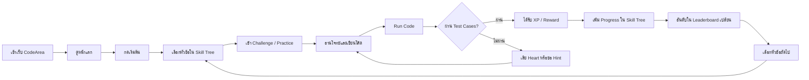

# CodeArea Presentation Outline

จำนวนสไลด์แนะนำ: **10 สไลด์**

โครงพรีเซนต์ใหม่นี้เรียงเรื่องตามลำดับที่ต้องการ:
1. แนะนำโปรเจคว่าคืออะไร
2. ฟีเจอร์หลักและกฎกติกาการเล่น
3. User Journey

---

## Slide 1: Cover

**หัวข้อ:** CodeArea

**Subtitle:** แพลตฟอร์มเรียนเขียนโปรแกรมผ่านระบบเกม

**เนื้อหาในสไลด์**
- ชื่อโปรเจค: CodeArea
- Tagline: Learn Programming Through Challenges
- ชื่อทีม / สมาชิก / รายวิชา / วันที่นำเสนอ

**ภาพที่ควรใช้**
- ภาพหน้าหลักของเว็บ
- ภาพ code editor หรือ visual ที่สื่อถึงการเรียน programming แบบ gamified

**เป้าหมายของสไลด์**
- เปิดให้ผู้ฟังเข้าใจทันทีว่าโปรเจคนี้เกี่ยวกับการเรียนเขียนโปรแกรม
- สร้างภาพจำว่า CodeArea เป็นพื้นที่ฝึกโค้ดที่มีความสนุกแบบเกม

---

## Slide 2: Project Introduction

**หัวข้อ:** CodeArea คืออะไร?

**คำอธิบายโปรเจค**
- CodeArea คือเว็บแอปสำหรับเรียนและฝึกเขียนโปรแกรมผ่านโจทย์ท้าทาย
- ผู้เรียนสามารถเลือกเส้นทางการเรียนจากหน้า Skill Tree
- เมื่อเลือกหัวข้อแล้ว ผู้เรียนจะเข้าสู่หน้า Challenge หรือ Practice เพื่อเขียนโค้ดแก้โจทย์
- ระบบมีคะแนน XP, พลังชีวิต, รางวัล และกระดานคะแนน เพื่อสร้างแรงจูงใจในการฝึกอย่างต่อเนื่อง

**ปัญหาที่โปรเจคต้องการแก้**
- การเรียน programming อาจดูยากและน่าเบื่อสำหรับผู้เริ่มต้น
- ผู้เรียนไม่รู้ว่าควรเริ่มจากหัวข้อไหนและควรไปต่ออย่างไร
- ขาด feedback ทันทีหลังฝึกเขียนโค้ด
- ขาดแรงจูงใจให้กลับมาฝึกซ้ำทุกวัน

**ประโยคสรุปสำหรับพูด**
- "CodeArea เปลี่ยนการฝึกเขียนโปรแกรมให้กลายเป็นเส้นทางการเรียนที่เห็นความก้าวหน้าและสนุกเหมือนการเล่นเกม"

---

## Slide 3: Project Goal & Target Users

**หัวข้อ:** เป้าหมายของโปรเจคและกลุ่มผู้ใช้

**1. กลุ่มเป้าหมาย**
- นักเรียนระดับมัธยมปลายที่เริ่มเรียนเขียนโปรแกรม
- นักศึกษาที่เรียนวิชา programming, algorithm หรือ data structure
- ผู้เริ่มต้นเขียนโค้ดที่ต้องการฝึกแก้โจทย์อย่างเป็นขั้นตอน
- คนทำงานหรือผู้ที่ต้องการ upskill ด้าน coding และ problem solving
- ผู้เรียนที่ต้องการเตรียมตัวสอบหรือฝึกโจทย์สำหรับการแข่งขัน / สัมภาษณ์งาน

**ลักษณะของผู้ใช้**
- ต้องการฝึกเขียนโค้ดแต่ไม่รู้ว่าจะเริ่มจากหัวข้อไหน
- ต้องการ feedback ทันทีหลังทำโจทย์
- ชอบระบบสะสมคะแนน การปลดล็อก และการแข่งขัน
- ต้องการเห็นความก้าวหน้าของตัวเองอย่างชัดเจน

**2. ปัญหา หรือเป้าหมายที่ต้องการสร้างแรงจูงใจ**
- ผู้เรียนจำนวนมากรู้สึกว่า programming และ algorithm ยากเกินไป
- การเรียนแบบเดิมอาจขาดความสนุกและทำให้เลิกฝึกกลางทาง
- ผู้เรียนไม่เห็นภาพรวมของเส้นทางการเรียน จึงไม่รู้ว่าควรฝึกอะไรต่อ
- การทำโจทย์โดยไม่มี feedback ทันทีทำให้แก้ข้อผิดพลาดได้ช้า
- ขาดแรงจูงใจในการกลับมาฝึกอย่างต่อเนื่อง

**เป้าหมายด้านแรงจูงใจ**
- ทำให้ผู้เรียนอยากกลับมาฝึกทุกวันผ่าน XP, Heart, Streak และ Reward
- ทำให้ผู้เรียนรู้สึกว่าการฝึกแต่ละครั้งมีความคืบหน้า
- ใช้ Leaderboard ช่วยสร้างการแข่งขันเชิงบวก
- ใช้ Skill Tree ช่วยให้ผู้เรียนเห็นเป้าหมายถัดไปและอยากปลดล็อกหัวข้อใหม่
- เปลี่ยนการเรียนเขียนโปรแกรมจากงานที่ยากให้เป็นประสบการณ์ที่ท้าทายและสนุก

**เป้าหมายของโปรเจค**
- ทำให้การเรียนเขียนโปรแกรมเข้าใจง่ายขึ้น
- ช่วยให้ผู้เรียนเห็นลำดับหัวข้อที่ควรฝึก
- ให้ feedback จากการรันโค้ดและ test cases
- เพิ่มแรงจูงใจด้วยระบบเกม เช่น XP, heart, leaderboard และ reward

**คุณค่าหลัก**
- เรียนเป็นขั้นตอน
- ฝึกจากโจทย์จริง
- เห็นผลลัพธ์ทันที
- มีแรงจูงใจให้ฝึกต่อเนื่อง

---

## Slide 4: Concept Board

**หัวข้อ:** Concept Board

**แนวคิดหลักของโปรเจค**
- CodeArea คือพื้นที่ฝึกเขียนโปรแกรมที่ผสมระหว่าง learning platform และ game experience
- คอนเซปต์หลักคือ **"เรียนรู้เป็นเส้นทาง ฝึกผ่านความท้าทาย และเติบโตด้วยรางวัล"**
- ภาพรวมควรให้ความรู้สึกว่า programming ไม่ใช่เรื่องน่ากลัว แต่เป็นภารกิจที่ผู้เรียนค่อย ๆ ผ่านด่านและพัฒนาตัวเอง

**Mood & Tone**
- สนุก แต่ยังดูเป็นเครื่องมือเรียนจริงจัง
- ท้าทาย แต่ไม่กดดันผู้เริ่มต้น
- ทันสมัย สะอาด อ่านง่าย
- ให้ความรู้สึกของการปลดล็อก การสะสมคะแนน และการพัฒนาทักษะ

**Visual Keywords**
- Skill Tree / Learning Path
- Code Editor
- Challenge Card
- XP / Heart / Streak
- Leaderboard
- Badge / Reward
- Progress Bar
- Locked / Unlocked Skill

**Color Palette**
- **Logic Blue:** ใช้กับข้อความหลัก พื้นที่โค้ด และความรู้สึกด้านเทคนิค
- **Achievement Green:** ใช้กับปุ่มหลัก progress success และสถานะผ่าน
- **Energy Orange:** ใช้กับ streak, action และจุดที่ต้องการเน้น
- **XP Yellow:** ใช้กับคะแนน รางวัล และ achievement
- **Heart Red:** ใช้กับพลังชีวิตหรือสถานะที่เกี่ยวกับโอกาสในการเล่น
- **Surface Soft / White:** ใช้เป็นพื้นหลังเพื่อให้ UI ดูสะอาดและอ่านง่าย

**Typography**
- Heading: Plus Jakarta Sans หรือ Sarabun
- Body: Inter หรือ Sarabun
- Code: JetBrains Mono

**องค์ประกอบที่ควรแสดงบน Concept Board**
- ตัวอย่างหน้าจอ Skill Tree
- ตัวอย่างหน้า Practice ที่มี code editor
- ชุด icon ของ XP, Heart, Streak, Badge
- ตัวอย่าง progress bar และ locked state
- ตัวอย่าง leaderboard หรือ ranking card
- ชุดสีและตัวอย่างฟอนต์

**ตัวอย่างไฟล์ Concept Board**
- ดูตัวอย่าง bento grid ได้ที่ `concept-board-bento.html`

**ภาพรวม Layout ของสไลด์**
- ซ้าย: mood keywords และคำอธิบาย concept
- กลาง: screenshot/mockup 2-3 ภาพ
- ขวา: color palette, typography และ icon set

---

## Slide 5: Main Feature 1 - Learning Path ใน Skill Tree

**หัวข้อ:** Learning Path: Skill Tree

**ฟีเจอร์นี้คืออะไร**
- หน้า Skill Tree เป็นแผนผังเส้นทางการเรียนของผู้ใช้
- แสดงหัวข้อ programming จากพื้นฐานไปสู่ระดับที่ยากขึ้น
- แต่ละหัวข้อมีสถานะ progress, difficulty และ lock/unlock

**สิ่งที่ผู้ใช้เห็นในหน้านี้**
- หัวข้อพื้นฐาน เช่น Syntax, Variables, Loops
- หัวข้อถัดไป เช่น Arrays, Strings, Recursion, Dynamic Programming
- Progress bar แสดงความคืบหน้าของแต่ละหัวข้อ
- สถานะ Locked สำหรับหัวข้อที่ยังไม่ปลดล็อก

**ประโยชน์**
- ผู้เรียนรู้ว่าตอนนี้ตัวเองอยู่ตรงไหน
- เห็นเป้าหมายถัดไปที่ควรฝึก
- ทำให้การเรียนไม่กระจัดกระจาย

**ภาพที่ควรใช้**
- Screenshot หรือ mockup หน้า Skill Tree
- ใส่ callout ชี้ progress bar, difficulty badge และ locked skill

---

## Slide 6: Main Feature 2 - Challenge / Practice

**หัวข้อ:** Challenge: Practice Mode

**ฟีเจอร์นี้คืออะไร**
- หน้า Challenge หรือ Practice คือพื้นที่ที่ผู้ใช้ลงมือเขียนโค้ดแก้โจทย์
- ผู้ใช้จะอ่านโจทย์ เขียนโค้ด กด Run Code และดูผลลัพธ์จาก test cases

**องค์ประกอบหลักในหน้า Practice**
- Problem Statement: คำอธิบายโจทย์
- Example: ตัวอย่าง input/output
- Constraints: เงื่อนไขของข้อมูล
- Code Editor: พื้นที่เขียนโค้ด
- Run Button: ปุ่มรันคำตอบ
- Test Cases: รายการทดสอบคำตอบ
- Output Panel: แสดงผลว่าผ่านหรือไม่ผ่าน

**ตัวอย่างโจทย์**
- หัวข้อ: Arrays
- โจทย์: Kadane Algorithm
- เป้าหมาย: หา subarray ที่มีผลรวมมากที่สุด

**ประโยชน์**
- ผู้ใช้ได้ฝึกคิดและเขียนโค้ดจริง
- เห็น feedback ทันทีหลังรัน
- สามารถแก้ไขและลองใหม่ได้จนกว่าจะผ่าน

---

## Slide 7: Game Rules - พลังชีวิตและการเล่น

**หัวข้อ:** กฎกติกาการเล่น: Heart System

**แนวคิดของพลังชีวิต**
- พลังชีวิตหรือ Heart ใช้แทนโอกาสในการเล่นหรือขอความช่วยเหลือ
- ระบบนี้ช่วยให้ผู้ใช้คิดก่อนลอง และทำให้การเล่นมีความท้าทายมากขึ้น

**กติกาที่แนะนำ**
- ผู้ใช้เริ่มต้นด้วย Heart จำนวนหนึ่ง เช่น 5 ดวง
- หากตอบผิดหรือรันไม่ผ่านหลายครั้ง อาจเสีย Heart
- หากต้องการ Hint หรือคำใบ้ อาจใช้ Heart
- ผู้ใช้สามารถได้รับ Heart เพิ่มจากการทำ Daily Check-in หรือทำภารกิจสำเร็จ

**ผลต่อประสบการณ์ผู้ใช้**
- ทำให้การแก้โจทย์มีความตื่นเต้น
- กระตุ้นให้ผู้เรียนอ่านโจทย์และวางแผนก่อนเขียนโค้ด
- ทำให้ระบบการเรียนมีความรู้สึกเหมือนเกมมากขึ้น

**ภาพที่ควรใช้**
- แถบ Heart ด้านบนของ UI
- ตัวอย่างปุ่ม Hint ที่แสดงค่าใช้จ่ายเป็น Heart

---

## Slide 8: Game Rewards - XP, Rewards และ Leaderboard

**หัวข้อ:** รางวัล XP และกระดานคะแนน

**XP System**
- เมื่อทำโจทย์ผ่าน ผู้ใช้จะได้รับ XP
- XP ใช้แสดงความก้าวหน้าและระดับความสามารถของผู้ใช้
- โจทย์ที่ยากขึ้นสามารถให้ XP มากขึ้น

**Reward System**
- ผู้ใช้ได้รับรางวัลเมื่อทำกิจกรรมสำเร็จ เช่น ผ่านโจทย์, login ต่อเนื่อง, ทำ quiz รายวัน
- รางวัลอาจเป็น XP, Heart, Badge หรือการปลดล็อกหัวข้อใหม่

**Leaderboard**
- แสดงอันดับผู้ใช้จากคะแนน XP
- ช่วยสร้างการแข่งขันระหว่างผู้เรียน
- ทำให้ผู้ใช้มีเป้าหมายในการฝึกมากขึ้น

**ตัวอย่างกติกาคะแนน**
- ผ่านโจทย์ง่าย: +50 XP
- ผ่านโจทย์ปานกลาง: +100 XP
- ผ่านโจทย์ยาก: +200 XP
- ทำ Daily Check-in: +50 XP และ +1 Heart

**ภาพที่ควรใช้**
- HUD ด้านบนที่มี XP, Heart, Streak
- Mockup หน้า Leaderboard
- Badge หรือ reward card

---

## Slide 9: User Journey Flow

**หัวข้อ:** User Journey

**คำอธิบาย Flow**
- ผู้ใช้เริ่มจากหน้าแรกและเข้าสู่เส้นทางการเรียน
- เลือกหัวข้อจาก Skill Tree
- ทำ Challenge ในหน้า Practice
- หากผ่าน จะได้รับ XP, Reward และ progress เพิ่มขึ้น
- หากไม่ผ่าน จะกลับไปแก้โค้ด อาจใช้ Heart เพื่อขอ Hint
- ผู้ใช้สามารถดูอันดับใน Leaderboard แล้วกลับไปฝึกต่อ

---

## Slide 10: Summary

**หัวข้อ:** สรุปภาพรวมของ CodeArea

**สรุปโปรเจค**
- CodeArea คือแพลตฟอร์มฝึกเขียนโปรแกรมที่ผสมการเรียนกับระบบเกม
- Learning Path ใน Skill Tree ช่วยจัดลำดับการเรียน
- Challenge / Practice ช่วยให้ผู้ใช้ฝึกแก้โจทย์จริง
- Heart, XP, Rewards และ Leaderboard ช่วยเพิ่มแรงจูงใจ
- User Journey ถูกออกแบบให้ผู้ใช้กลับมาฝึกซ้ำและพัฒนาต่อเนื่อง

**Closing Statement**
- "CodeArea ทำให้การเรียนเขียนโปรแกรมไม่ใช่แค่การทำแบบฝึกหัด แต่เป็นการเดินทางที่ผู้เรียนเห็นความก้าวหน้าของตัวเองทุกครั้งที่ลงมือฝึก"

**ภาพที่ควรใช้**
- ภาพรวม 3 หน้าจอ: Skill Tree, Practice, Leaderboard
- หรือ diagram สั้น ๆ: Learn -> Practice -> Reward -> Improve
